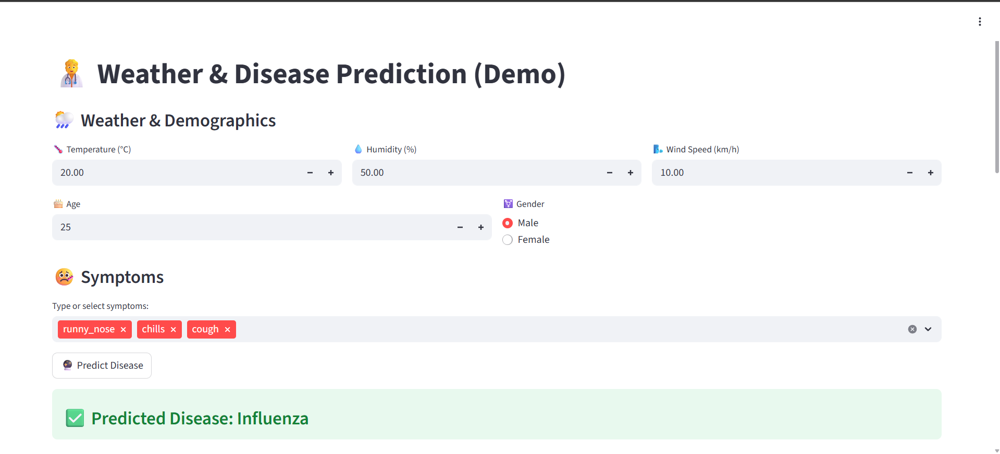
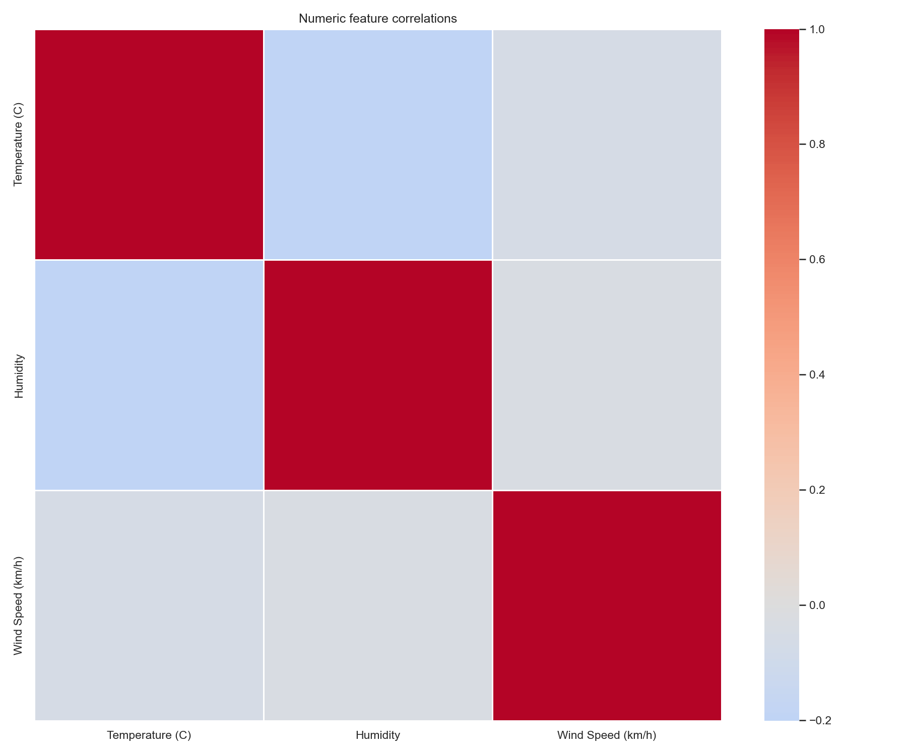
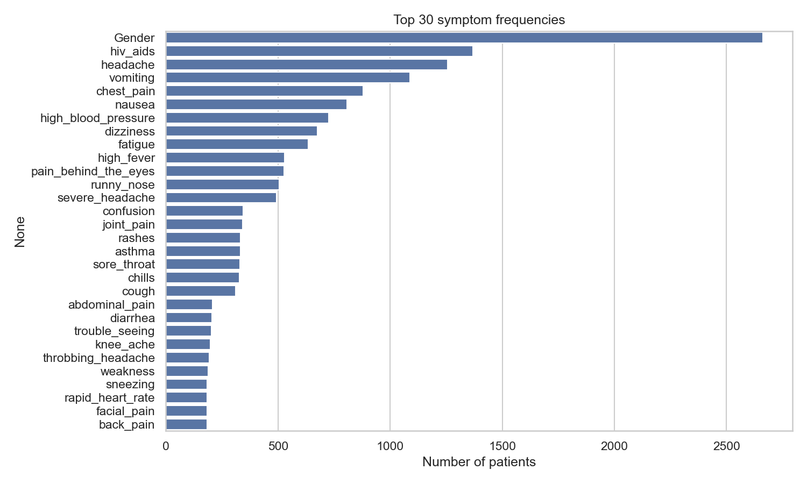
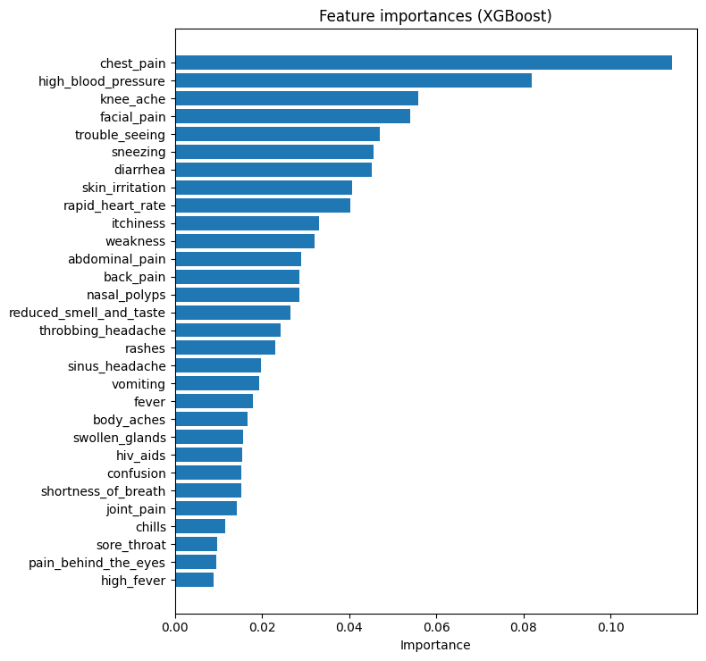
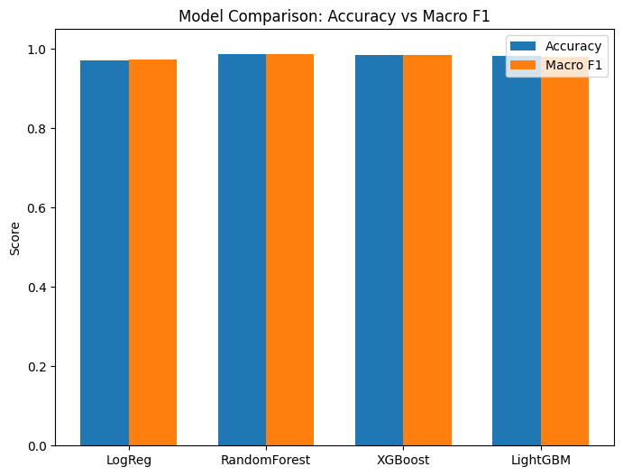

# Weather & Disease Prediction using Machine Learning

Predicts likely diseases from weather conditions and user‑reported symptoms using a trained ML model and a Streamlit UI.

# DS‑WEATHER‑DISEASE

[](https://www.python.org/)
[](https://streamlit.io)
[](https://scikit-learn.org)
[](https://www.docker.com/)
[](https://ds-weather-disease.onrender.com)
[](LICENSE)

Demo: https://ds-weather-disease.onrender.com

## 🚀 Features

- End‑to‑end pipeline: EDA → preprocessing → model training → deployment.
- Streamlit web app for interactive predictions and probability charts.
- Trained `RandomForestClassifier` with label encoding and saved artifacts (`joblib`).
- Simple, fast Docker image for production; deployable on Render Free plan.
- Reproducible notebooks and scripts for exploration and model iteration.

## 🧠 Architecture

- Technologies: Python, Streamlit, scikit‑learn, pandas/numpy, Docker, Render.
- Frontend and backend are a single Streamlit service. The app loads serialized model assets on startup and performs in‑process inference.
- No database or external services; no user data persisted.

High‑level flow:

```
User (Browser)
   │  HTTP (HTTPS via Render)
   ▼
Streamlit App (app.py)
   │  load
   ├─ models/weather_disease_model.joblib
   ├─ models/feature_names.joblib
   └─ models/label_encoder.joblib
   │  infer
   ▼
Prediction + Top‑K probabilities
```

## 🛠️ Tech Stack

- Python 3.11, Streamlit
- scikit‑learn, pandas, numpy, matplotlib
- Jupyter (EDA, notebooks)
- Docker (runtime), Render (hosting)

## 📦 Installation

Clone and set up a virtual environment:

```powershell
# Windows PowerShell
git clone https://github.com/AniketBansod/DS-WEATHER-DISEASE.git
cd DS-WEATHER-DISEASE
python -m venv venv; .\venv\Scripts\Activate.ps1
pip install -r requirements.txt
```

```bash
# macOS/Linux
git clone https://github.com/AniketBansod/DS-WEATHER-DISEASE.git
cd DS-WEATHER-DISEASE
python3 -m venv venv && source venv/bin/activate
pip install -r requirements.txt
```

Train and export artifacts (if the `models/` folder is missing):

```bash
python train_and_save.py
```

This produces:

- `models/weather_disease_model.joblib`
- `models/feature_names.joblib`
- `models/label_encoder.joblib`

## 🧪 Running the Project

Development mode (local):

```bash
streamlit run app.py
```

Production mode (without Docker):

```bash
# Use the minimal runtime requirements
pip install -r requirements-prod.txt
streamlit run app.py --server.address 0.0.0.0 --server.port 8501
```

Docker:

```bash
# Build and run locally
docker build -t ds-weather-disease .
docker run --rm -p 8501:8501 ds-weather-disease
# Visit http://localhost:8501
```

## 🔍 Usage

- Open the app, enter weather variables and select symptoms.
- Click “Predict” to see the predicted disease and a Top‑5 probability chart.
- Inputs are not stored; refresh/reset to try different scenarios.

## 🖼️ Screenshots & EDA

App UI (Streamlit):

<p align="center">
   
  
</p>

Key EDA outputs:

<p align="center">
   
   
</p>
<p align="center">
   
   
</p>

## ⚙️ Configuration

This demo does not require a `.env` file. Optional Streamlit/env toggles (already set in Dockerfile):

- `STREAMLIT_SERVER_ENABLE_CORS=false`
- `STREAMLIT_BROWSER_GATHER_USAGE_STATS=false`
- `PYTHONUNBUFFERED=1`

## 🧵 API Endpoints

Not applicable. This is a single‑page Streamlit app without a public REST API.

## 📈 Performance / Benchmarks

- Model: tuned RandomForestClassifier (from notebooks/scripts).
- Observed accuracy in local experiments: ~85–90% (dataset‑dependent). Treat as indicative only.

## 🧩 Folder Structure

```
DS-WEATHER-DISEASE/
├── app.py                    # Streamlit UI + inference
├── train_and_save.py         # Train model and export artifacts
├── requirements.txt          # Full dev requirements
├── requirements-prod.txt     # Minimal runtime requirements
├── Dockerfile                # Production container
├── .dockerignore
├── render.yaml               # Render service blueprint (optional)
├── data/                     # Raw dataset(s)
├── models/                   # Saved model + encoder + feature names
├── notebooks/                # EDA notebook(s)
├── outputs/                  # Figures, tables, intermediate results
├── src/                      # Utilities and analysis scripts
└── docs/                     # Deployment docs, notes
```

## 🛡️ Security

- No authentication; the app performs local inference only.
- No secrets or databases; HTTPS termination handled by Render.
- CORS is disabled for Streamlit (safe for same‑origin usage on Render).
- Do not upload sensitive data; this is an educational demo.

## 📦 Deployment

Render (manual Web Service using Dockerfile):

1. Push to branch `main`.
2. In Render: New → Web Service → select repo/branch.
3. Environment: Docker; Root directory: repo root.
4. Create. First build may take several minutes.
5. Live app: https://ds-weather-disease.onrender.com

Local Docker:

```bash
docker build -t ds-weather-disease .
docker run --rm -p 8501:8501 ds-weather-disease
```

More details: `docs/deploy_render.md`.

## 🧠 Future Improvements

- Add model versioning and experiment tracking (e.g., MLflow).
- Provide reproducible training pipeline (CLI) with config files.
- Add SHAP explanations in‑app for interpretability.
- Add simple authentication if exposing beyond demo use.
- Automated tests and CI for linting and basic e2e checks.
- Add caching of model loads and heavy computations.
- Add telemetry/usage metrics opt‑in.

## 📝 License

MIT. See `LICENSE` (add one if missing).

## 🙌 Acknowledgements

- scikit‑learn, pandas, numpy
- Streamlit
- Render (hosting)
